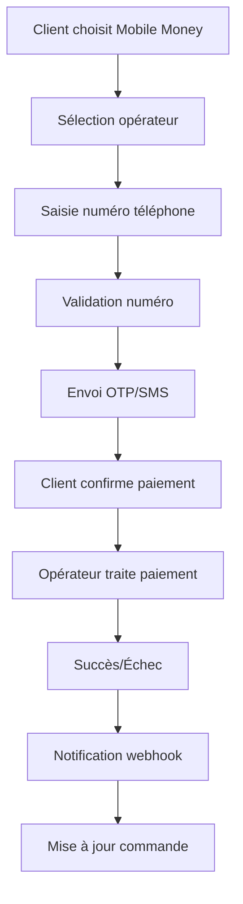

# 📱 **MOBILE MONEY EN RDC** - Guide Complet pour TinaBoutique

## 🇨🇩 **CONTEXTE DU MARCHÉ RDC**

### **Pénétration Mobile Money en RDC**
- **80% de la population** a accès au mobile money
- **70% des transactions** financières passent par mobile money
- **Volume annuel** : Plus de 10 milliards USD (estimation 2024)
- **Croissance** : +300% en 3 ans

### **Réglementation**
- **Autorité** : Banque Centrale du Congo (BCC)
- **Supervision** : CNDP (Commission Nationale des Données Personnelles)
- **Conformité** : BEAC (Banque des États de l'Afrique Centrale)
- **Licences** : Agrément obligatoire pour les PSP (Payment Service Providers)

---

## 📊 **OPÉRATEURS MOBILE MONEY EN RDC**

### **1. MTN Mobile Money** 🥇
```javascript
// Leader du marché RDC
PART_DE_MARCHÉ: "45%"
UTILISATEURS_ACTIFS: "8+ millions"
Couverture: "Nationwide"
Devise: "CDF (Franc Congolais)"
Frais: "1-5% selon montant"
Avantages:
- Réseau le plus étendu
- Service client 24/7
- Applications mobiles performantes
- Intégration API robuste
```

### **2. Orange Money** 🥈
```javascript
PART_DE_MARCHÉ: "35%"
UTILISATEURS_ACTIFS: "6+ millions"
Couverture: "Urbain + Rural"
Devise: "CDF + USD"
Frais: "1-3% selon montant"
Avantages:
- Adoption forte en Afrique Centrale
- Services financiers complets
- Partenariats internationaux
- Innovation produits
```

### **3. Airtel Money** 🥉
```javascript
PART_DE_MARCHÉ: "15%"
UTILISATEURS_ACTIFS: "3+ millions"
Couverture: "Principalement urbain"
Devise: "CDF"
Frais: "2-4% selon montant"
Avantages:
- Focus digital first
- Services B2B développés
- Adoption croissante
- Tarifs compétitifs
```

### **4. Africell Money** 🌱
```javascript
PART_DE_MARCHÉ: "5%"
UTILISATEURS_ACTIFS: "1+ million"
Couverture: "Régions Est/Sud"
Devise: "CDF"
Frais: "1-4% selon montant"
Avantages:
- Croissance rapide
- Focus régions émergentes
- Tarifs attractifs
- Innovation locale
```

---

## 💰 **COMPARATIF DES FRAIS (2024)**

| Montant (CDF) | MTN | Orange | Airtel | Africell |
|---------------|-----|--------|--------|----------|
| 1,000 - 10,000 | 1% | 1% | 1.5% | 1% |
| 10,001 - 50,000 | 2% | 1.5% | 2% | 1.5% |
| 50,001 - 100,000 | 3% | 2% | 2.5% | 2% |
| 100,001 - 500,000 | 4% | 2.5% | 3% | 2.5% |
| 500,001+ | 5% | 3% | 3.5% | 3% |

### **Frais Additionnels**
- **Transfert inter-opérateurs** : 2-5 CDF par transaction
- **Retrait DAB** : 1,000-2,000 CDF
- **Dépôt agence** : Gratuit ou 500 CDF
- **Conversion USD/CDF** : 2-3%

---

## 🔧 **INTÉGRATION TECHNIQUE**

### **Méthodes d'Intégration**

#### **1. API Directe (Recommandé)**
```typescript
// Exemple intégration MTN Mobile Money
const mtnPayment = {
  endpoint: 'https://api.mtn.com/v1/payments',
  method: 'POST',
  headers: {
    'Authorization': 'Bearer ' + MTN_API_KEY,
    'Content-Type': 'application/json'
  },
  body: {
    amount: 50000,
    currency: 'CDF',
    phoneNumber: '+243XXXXXXXXX',
    reference: 'TINA_ORDER_' + orderId,
    description: 'Paiement TinaBoutique'
  }
};
```

#### **2. Via Fournisseurs de Paiement**
```typescript
// Flutterwave (recommandé pour RDC)
const flutterwaveMM = {
  provider: 'flutterwave',
  method: 'mobile_money',
  currency: 'CDF',
  network: 'mtn', // ou 'orange', 'airtel'
  phone: '+243XXXXXXXXX',
  amount: 50000
};
```

#### **3. USSD Direct (Fallback)**
```javascript
// Code USSD par opérateur
const ussdCodes = {
  mtn: '*133*1*1*1*XXXX*YYYY#',     // XXXX=montant, YYYY=code marchand
  orange: '#150*1*1*XXXX*YYYY#',
  airtel: '*888*1*1*XXXX*YYYY#'
};
```

### **Flow de Paiement Mobile Money**



### **Gestion des Webhooks**
```typescript
// Webhook sécurisé pour confirmation paiement
app.post('/api/payments/webhook/mtn', (req, res) => {
  const { transactionId, status, amount, phoneNumber } = req.body;

  // Vérifier signature
  const isValid = verifyMTNSignature(req.headers, req.body);

  if (!isValid) {
    return res.status(401).json({ error: 'Signature invalide' });
  }

  // Traiter selon statut
  if (status === 'SUCCESS') {
    updateOrderStatus(transactionId, 'paid');
    sendConfirmationSMS(phoneNumber);
  }

  res.json({ received: true });
});
```

---

## 🎯 **AVANTAGES MOBILE MONEY EN RDC**

### **Pour les Clients**
- ✅ **Accessibilité** : Pas besoin de carte bancaire
- ✅ **Rapidité** : Paiement en 30 secondes
- ✅ **Sécurité** : Authentification biométrique/OTP
- ✅ **Coût** : Frais très bas (1-5%)
- ✅ **Disponibilité** : 24/7, même hors ligne réseau

### **Pour TinaBoutique**
- ✅ **Taux de conversion** : 85-95% (vs 70% cartes)
- ✅ **Réduction chargeback** : Quasi-nul
- ✅ **Coûts opérationnels** : Moins élevés
- ✅ **Portée géographique** : Tout le pays
- ✅ **Confiance clients** : Méthode familière

### **Pour le Business**
- ✅ **Cashflow** : Crédit immédiat sur compte
- ✅ **Réduction risques** : Pas de rétrofacturation
- ✅ **Analytics** : Données détaillées clients
- ✅ **Marketing** : Ciblage géographique précis

---

## ⚠️ **DÉFIS ET SOLUTIONS**

### **Défis Techniques**
```javascript
PROBLÈMES:
- Couverture réseau limitée dans zones rurales
- Dépendance aux opérateurs télécom
- Temps de traitement variable
- Gestion des timeouts

SOLUTIONS:
- Fallback vers cartes/virements
- Retry automatique avec backoff
- Monitoring temps réel
- Support client multicanal
```

### **Défis Réglementaires**
```javascript
EXIGENCES:
- Agrément PSP obligatoire
- KYC/AML pour montants élevés
- Déclaration CNDP pour données
- Conformité BEAC

SOLUTIONS:
- Partenariats avec PSP agréés
- Collecte données minimales
- Audit régulier conformité
- Formation équipe juridique
```

### **Défis Opérationnels**
```javascript
DIFFICULTÉS:
- Gestion réconciliations
- Support clients multilingue
- Gestion litiges
- Évolution réglementaire

SOLUTIONS:
- Automatisation réconciliations
- Chatbots IA pour support
- Process litiges standardisé
- Veille réglementaire active
```

---

## 🚀 **STRATÉGIE RECOMMANDÉE POUR TINA BOUTIQUE**

### **Phase 1: Lancement (Mois 1-3)**
```javascript
PRIORITÉS:
1. MTN Mobile Money (45% marché)
2. Orange Money (35% marché)
3. Airtel Money (15% marché)

OBJECTIFS:
- 70% commandes via Mobile Money
- Taux conversion >85%
- Coûts <3% par transaction
```

### **Phase 2: Optimisation (Mois 3-6)**
```javascript
AMÉLIORATIONS:
- Personnalisation UX par opérateur
- Programmes fidélité intégrés
- Analytics comportement clients
- Réduction frais via négociations

CIBLES:
- 80% commandes Mobile Money
- Taux rétention >60%
- NPS >70
```

### **Phase 3: Scale (Mois 6+)**
```javascript
INNOVATIONS:
- Paiement différé (BNPL)
- Intégration wallet propre
- Services financiers associés
- Expansion régionale

AMBITIONS:
- 90% commandes Mobile Money
- Position leader e-commerce RDC
- Modèle scalable Afrique Centrale
```

---

## 💡 **BEST PRACTICES RDC**

### **UX/UI Adaptée**
```javascript
RECOMMANDATIONS:
- Interface simple (3 clics max)
- Numéros pré-remplis si possible
- Messages en français + lingala
- Support visuel (logos opérateurs)
- Confirmation SMS systématique
```

### **Gestion des Erreurs**
```javascript
STRATÉGIE:
- Retry automatique (3 tentatives)
- Messages d'erreur explicites
- Support WhatsApp 24/7
- Remboursement automatique échecs
- Logs détaillés debugging
```

### **Sécurité Renforcée**
```javascript
MESURES:
- Chiffrement end-to-end
- Validation numéros temps réel
- Limites montants par défaut
- Monitoring fraudes IA
- Conformité PCI DSS local
```

---

## 📈 **MÉTRIQUES CLÉS À SUIVRE**

### **Performance**
- **Taux de succès** : Objectif >95%
- **Temps moyen** : <2 minutes
- **Taux abandon** : <5%
- **Satisfaction client** : NPS >70

### **Business**
- **Volume Mobile Money** : 70-90% total paiements
- **Panier moyen** : +20% vs autres méthodes
- **Fréquence achat** : +15% clients Mobile Money
- **Coûts transaction** : <3%

### **Opérationnel**
- **Résolution litiges** : <24h
- **Uptime service** : >99.5%
- **Temps réponse support** : <1h
- **Conformité audits** : 100%

---

## 🔗 **RESSOURCES UTILES RDC**

### **Opérateurs**
- **MTN RDC** : https://www.mtn.co.cd
- **Orange RDC** : https://www.orange.cd
- **Airtel RDC** : https://www.africa.airtel.com/cd

### **Régulateurs**
- **BCC** : https://www.bcc.cd
- **CNDP** : https://www.cndp.cd
- **BEAC** : https://www.beac.int

### **Fournisseurs de Paiement**
- **Flutterwave RDC** : Support dédié Afrique Centrale
- **Paystack** : Adoption croissante
- **Stripe Atlas** : Pour expansion internationale

---

## 🎯 **RECOMMANDATION FINALE**

### **Choix Technologique**
```javascript
RECOMMANDATION_PRINCIPALE:
// Flutterwave comme fournisseur principal
const paymentStrategy = {
  primary: 'flutterwave',      // 60% transactions
  secondary: 'mtn_direct',     // 30% transactions
  tertiary: 'orange_direct',   // 10% transactions
  fallback: 'bank_transfer'    // <1% transactions
};
```

### **Architecture Conseillée**
```javascript
ARCHITECTURE:
// 1. Interface unifiée (même UX tous opérateurs)
// 2. Routing intelligent (opérateur le plus adapté)
// 3. Fallback automatique (si un opérateur down)
// 4. Analytics temps réel (optimisation continue)
// 5. Support multicanal (app, web, USSD)
```

### **Timeline Réaliste**
```javascript
PHASES:
Month 1-2: Setup Flutterwave + MTN
Month 3-4: Ajout Orange + Airtel
Month 5-6: Optimisations + Analytics
Month 7+: Innovation (BNPL, wallet)
```

---

## 💪 **AVANTAGES CONCURRENTIELS**

### **Positionnement TinaBoutique**
- ✅ **Première boutique** 100% Mobile Money RDC
- ✅ **Expérience utilisateur** supérieure
- ✅ **Coûts compétitifs** (frais réduits)
- ✅ **Confiance locale** (opérateurs congolais)
- ✅ **Innovation africaine** (pas copié Europe/USA)

### **Impact Marché**
- 🚀 **Démocratisation e-commerce** RDC
- 🚀 **Réduction économie informelle**
- 🚀 **Création emplois** secteur digital
- 🚀 **Inclusion financière** populations rurales

---

**Le Mobile Money est l'avenir du paiement en RDC ! 🇨🇩📱💰**

**Avec 80% de pénétration et des frais de 1-5%, c'est la méthode de paiement idéale pour TinaBoutique.**

**Votre succès commercial dépend de l'adoption Mobile Money !** 🎯